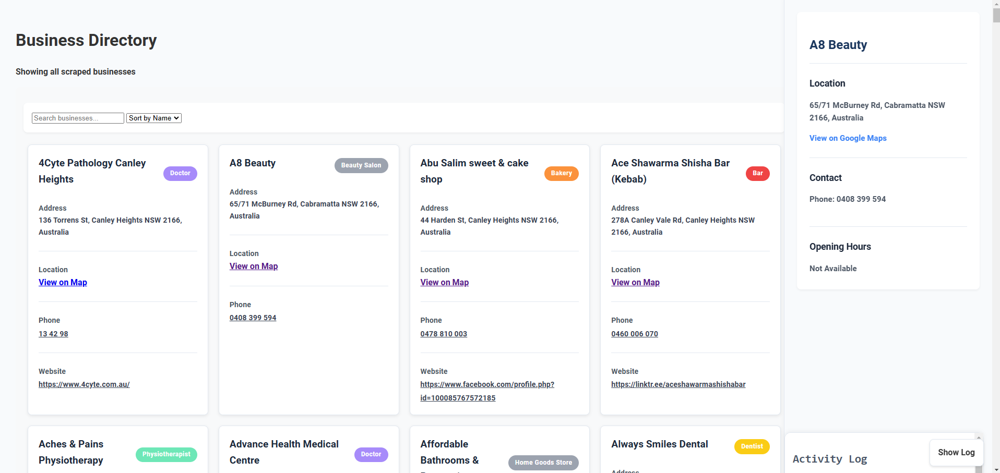

# Business Scraper and Dashboard

This project consists of a Python-based Google Maps scraper and a web-based dashboard to display the scraped business data.

## Prerequisites

Before you begin, ensure you have the following installed:

-   **Python 3.8+**: You can download it from [python.org](https://www.python.org/downloads/).
-   **pip**: Python's package installer, usually included with Python.
-   **A Google Maps API Key**: You'll need to obtain this from the [Google Cloud Console](https://console.cloud.google.com/).

## Setup

1.  **Clone the repository:**

    ```bash
    git clone <repository_url>
    cd <repository_directory>
    ```

2.  **Create a virtual environment (recommended):**

    ```bash
    python -m venv venv
    ```

    -   On Windows, activate the environment:

        ```bash
        venv\Scripts\activate
        ```
    -   On macOS and Linux, activate the environment:

        ```bash
        source venv/bin/activate
        ```

3.  **Install dependencies:**

    ```bash
    pip install -r requirements.txt
    ```

4.  **Create a `.env` file:**

    In the root directory of the project, create a file named `.env` and add your Google Maps API key:

    ```
    GOOGLE_MAPS_API_KEY=YOUR_GOOGLE_MAPS_API_KEY
    ```

    Replace `YOUR_GOOGLE_MAPS_API_KEY` with your actual API key.

## Running the Scraper

The scraper is a command-line tool that fetches business data from Google Maps.

1.  **Run the scraper:**

    ```bash
    python google_maps_scraper.py
    ```

    The scraper will prompt you for:
    -   The town/address to search near.
    -   A search radius in kilometers.
    -   The business types to search for (or select "all").

    The scraper will then fetch business data and save it to `businesses.json`. It will also log its activity to `scraper.log`.

    **Important:** The scraper uses the Google Maps API, which has usage limits and costs. Be mindful of the number of requests you make.

## Running the Dashboard

The dashboard is a simple HTML/JavaScript application that displays the data from `businesses.json`.

1.  **Open `index.html` in your browser:**

    You can simply open the `index.html` file in your web browser. The dashboard will load the `businesses.json` file locally and display the data.

    -   On Windows, you can use the following command:

        ```bash
        start index.html
        ```
    -   On macOS, you can use the following command:

        ```bash
        open index.html
        ```
    -   On Linux, you can use the following command:

        ```bash
        xdg-open index.html
        ```

    The dashboard provides:
    -   A search bar to filter businesses by name or type.
    -   A dropdown to sort businesses by name, type, or date.
    -   A sidebar to display detailed information about a selected business.
    -   A console log to show the activity of the dashboard.

## Important Notes

-   The `businesses.json` file is created or updated by the scraper. The dashboard reads this file to display the data.
-   The dashboard is a static HTML file and does not require a server to run.
-   The scraper logs its activity to `scraper.log`.
-   The scraper uses caching to avoid duplicate requests.
-   The scraper will automatically save results to `businesses.json` without confirmation.
-   The scraper will filter out duplicate businesses based on name and address.
-   The scraper will add metadata to each business, including the search location, radius, and date.

## Dependencies

The project uses the following Python libraries:

-   `fastapi`
-   `uvicorn`
-   `python-dotenv`
-   `googlemaps`
-   `pandas`
-   `python-multipart`

These are listed in the `requirements.txt` file.

## Contributing

Feel free to contribute to this project by submitting pull requests.

## License

This project is licensed under the MIT License.

## Screenshot


